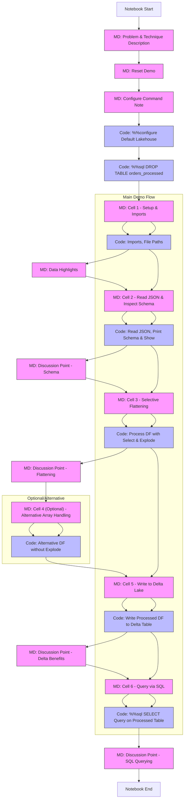

# Data Engineering Demos with Fabric Spark Notebooks

## 1. Efficiently Processing & Querying Highly Nested, Schema-Variable JSON

* **Problem:** Source systems often output deeply nested JSON with arrays, complex objects, and fields that might appear/disappear between records. Flattening everything can be inefficient or lead to massive tables. Querying specific nested elements directly can be cumbersome with basic tools.
* **Trickiness:** Schema evolution, deeply nested structures, arrays, inconsistent fields make simple flattening or SQL querying difficult and inefficient. `explode()` can cause row explosion.
* **Technique (Spark Notebook):**
    * **Selective Flattening & Struct Navigation:** Instead of full flattening, use PySpark to read the JSON (inferring schema or providing a robust one). Employ `select()` with complex path expressions (`col("address.city")`, `col("orders[0].item_id")`) and functions like `explode()` (for arrays), `element_at()` (for specific array elements or map values), and `getField()` to extract *only* the necessary top-level and specific nested fields into a structured DataFrame. Keep other less-used nested parts as `StructType` columns.
* **Demo Focus:** Read complex `JSON` from `OneLake`/`Lakehouse` -> Apply selective flattening/struct navigation -> Show querying the resulting DataFrame with a mix of flat columns and accessible structs -> Optionally show a `Pandas UDF` tackling a particularly messy part -> Write results to a `Delta Lake` table, queryable via the `SQL endpoint`.

## 2. Large-Scale User Sessionization with Variable Inactivity Windows

* **Problem:** Grouping raw event logs (clicks, views) into user sessions based on inactivity (e.g., 30 mins) is standard, but doing it efficiently over billions of events and potentially allowing *different* inactivity thresholds per user type or activity type adds complexity.
* **Trickiness:** Defining session boundaries, grouping events per user *within* those boundaries efficiently over massive datasets without excessive shuffling or complex state management.
* **Technique (Spark Notebook):**
    * **Advanced Window Functions:** Use `PySpark` window functions partitioned by `userId` and ordered by `timestamp`.
        * Calculate time difference using `lag()`.
        * Use a conditional `sum()` over the window (`sum(when(time_diff > threshold, 1, 0).over(window_spec))`) to dynamically create a `sessionId` that increments only when the threshold is breached. This avoids complex state management loops.
        * *For variable thresholds:* Join the event log DataFrame with a user/activity dimension table *before* applying the window function, making the `threshold` value dynamic within the `when()` condition based on user/activity attributes.
* **Demo Focus:** Read event logs (`Delta table`, perhaps populated by `Eventstream`) -> Join with user/activity data (another `Delta table`) if variable thresholds needed -> Apply window functions (`lag`, conditional `sum`) to generate `sessionId` -> Group by `userId`, `sessionId` to calculate session metrics (start/end time, duration, event count) -> Write sessionized data to a `Delta table`.

## 3. Implementing Performant SCD Type 2 Logic on Delta Lake

* **Problem:** Handling Slowly Changing Dimensions (Type 2: adding new rows for changes, marking old rows inactive) requires careful comparison, updates, and inserts. Naive approaches (full outer joins, overwrites) don't scale well on large dimension tables.
* **Trickiness:** Requires comparing incoming data with existing dimension data, identifying changes, expiring old records (updating `EndDate`, `IsCurrent`), inserting new records, and handling keys efficiently at scale.
* **Technique (Spark Notebook):**
    * **Delta Lake `MERGE INTO`:** Showcase the optimized `MERGE INTO` command available for Delta tables. This is the most idiomatic and performant solution.
    * Demonstrate a single `MERGE` statement handling multiple conditions:
        * `WHEN MATCHED AND <new_data.hash != current_data.hash>` -> `UPDATE SET IsCurrent = false, EndDate = new_data.EffectiveDate` (Expire old record)
        * Followed by logic (potentially a second `INSERT` outside the merge or more complex merge actions) to insert the *new* version of the changed record (`IsCurrent = true, StartDate = new_data.EffectiveDate`).
        * `WHEN NOT MATCHED BY TARGET` -> `INSERT (new record values)` (Insert brand new records)
        * Use hashing (`md5()`, `sha2()`) on relevant columns (excluding keys/audit dates) to efficiently detect actual changes.
* **Demo Focus:** Have a source `Delta table` with new/changed dimension data and a target `SCD Type 2` `Delta` dimension table -> Execute the `MERGE INTO` command from the Spark Notebook (using `spark.sql()`) -> Query the target table before and after, showing expired and newly activated records. Use `Delta Time Travel` to query the dimension *as of* a previous version.

## 4. Fuzzy Matching & Deduplication Across Multiple Columns

* **Problem:** Identifying duplicate customers/entities when key attributes (name, address, company) have typos, variations, or are missing. Simple `distinct()` or `groupBy()` won't work. Requires approximate matching logic, often across several fields combined.
* **Trickiness:** Scaling N x N comparisons is computationally prohibitive. Requires efficient candidate generation and robust similarity scoring.
* **Technique (Spark Notebook):**
    * **Blocking & Candidate Pair Generation:** Implement a blocking strategy first (e.g., group records by the first 3 letters of the postcode or `Soundex` of the name) to drastically reduce the number of pairs that need detailed comparison. Generate candidate pairs *within* blocks.
    * **Pandas UDF with Fuzzy Libraries:** Use a `Pandas UDF` to apply sophisticated fuzzy matching logic to the candidate pairs. The UDF can take relevant columns (name, address components) for a pair, use Python libraries like `thefuzz` or `recordlinkage` to calculate similarity scores (e.g., `Levenshtein`, `Jaro-Winkler`, token set ratio), potentially combine scores across multiple fields, and output a match score or boolean flag.
* **Demo Focus:** Read raw customer data from a `Lakehouse table` -> Apply blocking -> Generate candidate pairs -> Use `Pandas UDF` for fuzzy scoring -> Filter pairs above a similarity threshold -> Optionally show how to link/cluster duplicates -> Write results (e.g., duplicate pairs, unique identifiers) to a `Delta table`.

## 5. Dynamic Schema Evolution Handling & Data Quality Enforcement

* **Problem:** Source data schemas can change unexpectedly (new columns, changed types). Applying fixed data quality rules breaks easily. Need a way to adapt to schema changes while still enforcing relevant quality checks dynamically.
* **Trickiness:** Need to make DQ checks aware of the *current* schema and avoid failing if a rule references a now-missing column, while still applying all relevant rules for existing columns.
* **Technique (Spark Notebook):**
    * **Leverage Delta Lake Schema Evolution & Constraints:** Read source data using Delta Lake's schema merging capabilities (`option("mergeSchema", "true")`). This handles additive column changes automatically. Define `Delta Lake` `CHECK` constraints for critical, stable quality rules (e.g., `ID IS NOT NULL`, `country IN ('USA', 'Canada')`). Show how inserts violating these fail.
    * **Dynamic Rule Application via Metadata:** For more complex or evolving rules: Store DQ rules (column name, rule type like 'isType', 'regexMatch', 'valueInSet', parameters) in a separate configuration source (e.g., another `Delta table`, `JSON` file). In the notebook, read the *current* schema of the target DataFrame (`df.schema`). Read the DQ rules. Write `PySpark` code that iterates through the rules, checks if the rule's column *exists* in the current schema using `df.columns` or `df.schema.fieldNames()`, and *then* dynamically constructs and applies the check (e.g., using `withColumn` and `when`/`otherwise` or filtering). Log records failing dynamic checks.
* **Demo Focus:** Show reading data with `mergeSchema`. Demonstrate a `CHECK` constraint failing. Define rules externally -> Read rules and target data -> Introspect data schema (`df.schema`) -> Dynamically apply only relevant/possible rules based on current schema -> Report violations -> Write cleansed data, potentially adding quality metadata columns. Orchestrate via a `Fabric Pipeline`.
